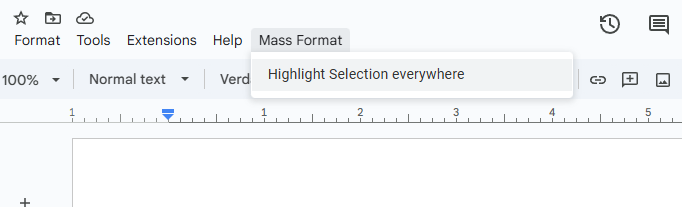

# Mass Format (Apps Script)



A collection of formatting tools for Google Docs that operate on all instances of the currently selected text.

The project is written for Google Apps Script (TypeScript)

---

## Features

- Adds a `Mass Format` menu to selected Google Docs
- Highlight every instance of the selected word or phrase in the active Google Doc.

Future ideas (placeholders):
- Bold / Italicize all instances
- Change font/color/size for all instances
- Apply paragraph styles

---

## Screenshots


---

## Operation

The script can be used as a Container Script - in this case, it would operate only in one Doc, via the `OnOpen()` function.

The script also supports multiple Docs by embedding custom `OnOpen` script triggers. The `installTriggersFromScriptParameters()` loops over Doc id's supplied via the `DOC_IDS` script parameter, and installs menu creation triggers in all of them.

## Quick usage

1. Deploy as a standalone script (eg, using `clasp`)
2. Add a Google Doc Id into the `DOC_IDS` script property
3. Run `installTriggersFromScriptParameters()` function
4. Open a Google Doc that has the script installed (see deployment section).
5. Select a word or phrase in the document.
6. From the menu: `Mass Format` → `Highlight Selection everywhere`.
7. Pick a color in the dialog. The script will highlight all occurrences and show a short notification.

Notes:
- The selection must be present before opening the color picker or the script will prompt you to select text first.
- Currently the script supports only highlighting. More formatting options may be added.

---

## Installation / Deploy

```bash
# install clasp globally (if you don't have it)
npm install -g @google/clasp

# login once
clasp login

# create or clone a project, then push
clasp create --type docs --title "Mass Format"   # OR
clasp clone <SCRIPT_ID>

# push your local files to Apps Script
clasp push
```

See `https://github.com/google/clasp` for full clasp docs.

---
